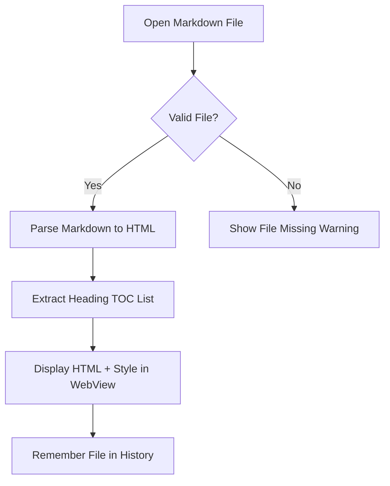

# Welcome to Markdown Reader!

This is a beautiful, modern Markdown reader built with **JavaFX** and the **Commonmark-java** library. It features a complete set of features for reading markdown documents comfortably.

## Features

- **Split Navigation Pane**: Easily browse your files and document sections.
- **Table of Contents (TOC)**: Automatically extracts document outline headings.
- **History Tracking**: Automatically tracks and remembers the last 10 files you opened.
- **Dynamic Themes**: Toggles between Light and Dark modes seamlessly.
- **Drag & Drop**: Drop any `.md` file onto the window to open it instantly.
- **Syntax Highlighting**: Supports language-aware highlighting for multiple languages.
- **Mermaid Diagrams**: Renders interactive flowcharts and sequence diagrams.

---

## Rich Content Examples

### 1. Tables

| Feature | Support | Performance |
| :--- | :---: | :---: |
| GFM Markdown | Yes | Excellent |
| Tables | Yes | Excellent |
| Code Fences | Yes | Fast |
| Dark/Light Theme | Yes | Instant |

### 2. Code Block Syntax Highlighting

```java
package org.ciberdim.mdreader;

public class Main {
    /**
     * Application bootstrap launcher.
     */
    public static void main(String[] args) {
        System.out.println("Hello, Markdown World!");
        App.main(args);
    }
}
```

```javascript
// Dynamic CSS Theme switcher
function toggleTheme(isDark) {
    const body = document.body;
    body.className = isDark ? 'dark-theme' : 'light-theme';
}
```

### 3. Diagram Rendering (Mermaid)

Below is an interactive flowchart rendered natively by Mermaid.js:



Here is a sequence diagram example showing user interaction:

```sequence
User->MainWindow: Drag & Drop sample.md
MainWindow->MarkdownParser: parse(sample.md)
MarkdownParser-->MainWindow: MarkdownDocument(HTML, Headings)
MainWindow->ReaderView: showContent(HTML)
MainWindow->SidebarView: setOutline(Headings)
MainWindow->RecentFilesManager: addFile(sample.md)
```

---

## Navigation & Shortcuts

Use the following shortcuts to control the reader:

* `Ctrl + O` (or `Cmd + O`): Open a new Markdown file.
* `Ctrl + W`: Close the active file.
* `Ctrl + B`: Toggle (collapse/expand) the sidebar.
* `Ctrl + T`: Toggle between Light and Dark mode.

Enjoy reading!
